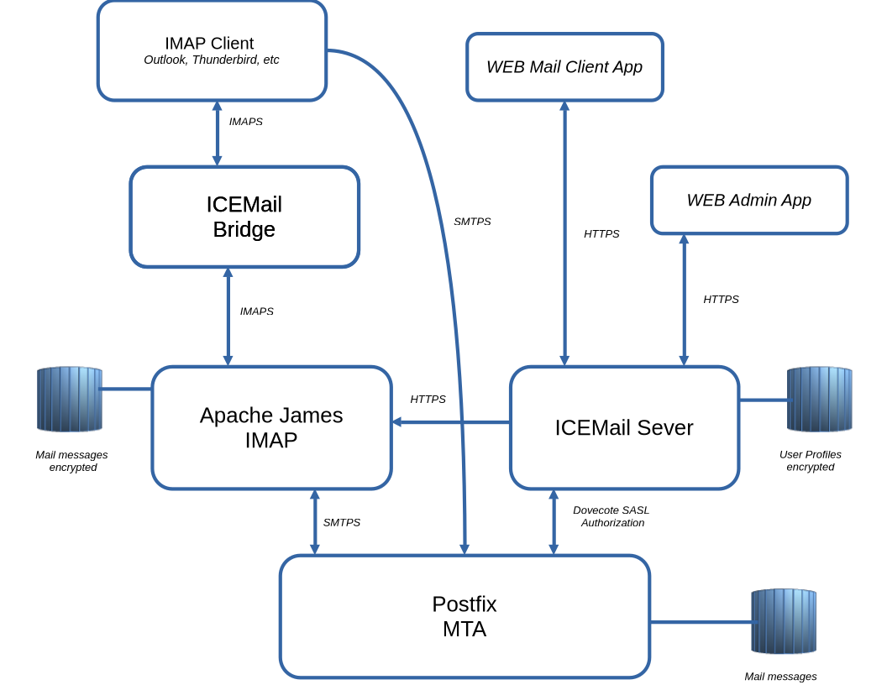

## ICEMail
# Why?
**_Why would you like to run your own mail server?_**  
The simple answer is, you do not! Unless you have close to sick desire to for spending time on a
challenging exercise and/or crazy about your privacy.

**[Just Google pros/cons](https://www.google.com/search?q=why+should+you+run+your+own+mail+server&oq=why+should+you+run+your+own+mail+server)**

_Personally, I have hosted my own mail server for over 20 years. It started off as a fun and interesting project, 
and it has continued for no particular reason! 😊 However, it hasn't always been enjoyable or intriguing. 
For me this project was about learning a little bit more about how different mail components are interconnected
and just have anything to do on my so called, infinite vaccation_.


## What is ICEMail?

ICEMail is a self-hosted, end-to-end encrypted mail system inspired by [Proton Mail](https://en.wikipedia.org/wiki/Proton_Mail),
but designed to run on your own infrastructure. The goal is straightforward: you own your mail server, you own your keys,
and no part of the system — not even the server — can read your messages.

The project is a personal endeavour started during retirement, with no commercial ambition. If it becomes useful to others,
that is a welcome bonus. It is also my first experience using AI (Claude) as a development aid — a pairing that has proven
more productive than expected. _(wounder what the last sentence came from?)_

---
<div style="text-align: center;">

</div>

## Core Philosophy — Encrypted Everywhere, Keys Nowhere on the Server

The central design principle is that **the server is blind**. Every message is encrypted before it enters the mailbox,
and every piece of sensitive user data is encrypted before it leaves the client. Concretely:

- **Messages at rest** — All mail stored in the IMAP server is PGP-encrypted with the recipient's public key before
  delivery. The IMAP server holds only ciphertext and has no access to any decryption key.

- **Messages in transit** — All network connections use TLS. The web interface and REST API run over HTTPS.
  IMAP access uses IMAPS (TLS). SMTP submission uses STARTTLS.

- **Passwords** — The user's password never leaves the browser or mail client in cleartext. It is hashed using
  PBKDF2 (100 000 iterations, SHA-256) client-side before being transmitted or stored. The server stores and
  compares only the hash.

- **Private keys** — Each user has a PGP key pair generated entirely in the browser at account creation. The
  private key is double-protected: first it is passphrase-protected by the user's own password (standard PGP),
  then the armored key is symmetrically encrypted again with the password using OpenPGP before being uploaded.
  The server stores an encrypted blob it cannot decrypt.

- **Decryption happens at the client** — In the web interface, decryption runs in the browser using `openpgp.js`.
  When using a standard mail client (Thunderbird, etc.) the ICEMail Bridge running on the user's own machine
  performs decryption locally before handing the message to the client. At no point does plaintext mail cross
  the server.
  
   Since all encryption, takes place in the _mail client_, standard mail clients like Outlook, Thunderbird etc. can not connect 
   and process mail as when using ordinary smtp/imap servers. Therefor there is a simple web interface has been provided 
   handling the extended encryption. However, standard mail clients can be used if connect via en [ICEMail Bridge](#icemail-bridge--new-development) 


---

## Components and Their Roles

The system is built from four components. Two are standard open-source infrastructure used without modification,
one is a fork with targeted additions, and two are written from scratch as part of this project.

### ICEMail Server — *new development*

The heart of the system. A Java 21 application built on the Javalin/Jetty framework, providing:

- **User profile database** — SQLite3 store of usernames, PBKDF2-hashed passwords, PGP public keys,
  and password-encrypted private keys. All sensitive fields are encrypted before they arrive.
- **REST API** — HTTPS endpoints for registration, login, session management, and web mail operations.
- **Web interface** — A browser-based mail client (HTML/JS) that fetches encrypted mail from James and
  decrypts it client-side using `openpgp.js`. No plaintext mail is ever served to the browser.
- **Postfix after-queue filter** — An SMTP filter that Postfix routes all inbound mail through. It looks up
  the recipient's public PGP key, encrypts the message body with AES-256 before re-injecting it back into
  Postfix for final delivery. This is where plaintext mail becomes ciphertext.
- **Dovecot SASL server** — An embedded SASL authentication service that Postfix delegates SMTP AUTH
  decisions to, allowing mail clients to submit mail using their ICEMail credentials without a separate
  user database in Postfix.
- **Postfix policy service** — A lightweight TCP policy server (port 10028) that Postfix calls after each
  successfully submitted message. It records outbound mail statistics and always passes the message through
  without interfering with delivery.
- **Admin interface** — Browser-based administration for managing users, monitoring the IMAP server, and
  viewing server statistics (registered users, logins, mail sent and received in the last 24 hours).

### ICEMail Bridge — *new development*

A lightweight IMAP proxy that runs on the **user's own machine**, not on the server. It enables any
standard IMAP/SMTP mail client to work transparently with the ICEMail encrypted infrastructure:

- **IMAP proxy** — Listens for standard IMAP or IMAPS connections from the mail client. Intercepts the
  LOGIN command and hashes the user's password with PBKDF2 before forwarding it to James, so the client
  can authenticate with its real password while the server only ever sees the hash. Incoming messages
  are decrypted on the fly using the user's PGP private key before being passed to the mail client.
- **SMTP proxy** — Optionally listens for SMTP submission from the mail client and proxies it to Postfix,
  again hashing the password in transit so the credential reaching the server is always the PBKDF2 hash.

The mail client needs no plugins and no knowledge of PGP. From its perspective it is talking to a normal
IMAP/SMTP server.

### Apache James (IMAP server) — *forked and extended*

[Apache James](https://james.apache.org/) is a mature, open-source Java mail server. In ICEMail it serves
as the IMAP store — it receives delivered mail via LMTP, stores mailboxes, and serves IMAP sessions.
James has no knowledge of the encryption; to it the messages are just data.

The fork adds two features not in the upstream project:

- **User synchronisation** — James polls the ICEMail Server at startup to mirror user accounts
  (usernames and hashed passwords) into its own Derby database. The sync first fetches the admin
  password from the `/api/admin` endpoint (IP-allowlisted), then uses HTTP Basic Auth to call
  `/admin/users` (session or Basic Auth protected). No separate user administration is needed in James.
- **WebAdmin REST API** — An embedded admin API (port 8000, bound to localhost) that the ICEMail Server
  proxies to the browser admin interface, exposing mailbox statistics, queue inspection, and dead-letter
  management.

Everything else — IMAP protocol handling, mail storage (Derby + Lucene), LMTP delivery acceptance — is
standard Apache James.

### Postfix (MTA) — *standard, unmodified*

[Postfix](https://www.postfix.org/) is used as the Mail Transfer Agent with no code changes whatsoever.
It is configured (not coded) to integrate with the ICEMail ecosystem:

- Receives inbound mail from the internet on port 25 (standard MX).
- Routes all inbound mail through the ICEMail Server after-queue filter on port 10026 before delivery.
- Accepts re-injected, encrypted mail from the filter on port 10027 and delivers it to James via LMTP on port 24.
- Accepts authenticated SMTP submission on port 587 (STARTTLS), delegating credential validation to the
  ICEMail Server's SASL server on port 12345.
- After each successfully submitted message, calls the ICEMail Server's **Postfix policy service** on
  port 10028 (via `smtpd_end_of_data_restrictions = check_policy_service`) to record sent-mail statistics.
  The policy service always responds `dunno` — it never rejects mail.

No Postfix source code is touched. The integration is entirely through Postfix's standard
`content_filter`, `smtpd_sasl_type = dovecot`, and `smtpd_end_of_data_restrictions` configuration directives.

---

## Component Adaptation Summary

| Component | Origin | Adaptation |
|---|---|---|
| **ICEMail Server** | New development | 100% new — REST API, web app, after-queue filter, SASL server, user DB |
| **ICEMail Bridge** | New development | 100% new — IMAP proxy, SMTP proxy, PGP decryption, PBKDF2 login handler |
| **Apache James** | Open source fork | Two additions: user sync from ICEMail Server, WebAdmin REST API |
| **Postfix** | Standard installation | Zero code changes — integration via configuration only |

---

## Encryption in Practice

ICEMail applies encryption at multiple layers, covering both transport security and message confidentiality.

### Transport Encryption (SMTP between servers)

When Postfix exchanges mail with other servers on the internet, TLS is used **opportunistically**. Postfix will attempt to establish a TLS-encrypted connection for both inbound and outbound SMTP, but will fall back to plaintext if the remote server does not support TLS. This is standard behaviour for internet mail and provides best-effort transport confidentiality without breaking compatibility with older or misconfigured servers.

### End-to-End Encryption for Local Users

All mail delivered to a user whose mailbox is hosted on the ICEMail server is encrypted **before** it is stored. The ICEMail after-queue filter intercepts every inbound message after Postfix accepts it, looks up the recipient's PGP public key, and encrypts the message body using AES-256 with the session key wrapped in the recipient's public key. Only the ciphertext is delivered to the IMAP store (Apache James). Neither the server nor anyone with access to the server's filesystem or database can read the message content.

**All messages persisted in the ICEMail IMAP server are PGP-encrypted — without exception.** There is no plaintext mail at rest anywhere in the system.

This encryption is applied regardless of where the mail originates — whether from another ICEMail user, an external sender, or a mailing list.

### Mail to External Recipients

Mail sent from ICEMail to recipients on **external mail servers** is delivered as ordinary internet mail and is **not end-to-end encrypted by default**. There is no general mechanism to obtain an external recipient's PGP key automatically, and external mail servers are not expected to accept PGP-encrypted payloads. Transport-level TLS is still applied where the receiving server supports it.

### Encrypted Mail to External Recipients via Link

For situations where sensitive content must be sent to an external recipient, the web mail compose page provides an optional password-based encryption feature. When used:

1. The message body is encrypted in the browser using AES with a user-chosen password.
2. The encrypted payload is stored temporarily on the ICEMail server.
3. A plain-text mail is sent to the external recipient containing a link to a decryption page on the ICEMail web interface.
4. The recipient opens the link, enters the agreed password, and the message is decrypted and displayed entirely in their browser.

The ICEMail server never sees the password or the plaintext — decryption happens client-side in the recipient's browser. The shared password must be exchanged with the recipient through a separate, trusted channel (phone call, Signal, etc.).

### Encrypted Mail via Standard Mail Clients (Mailbridge)

Users who prefer to use a standard mail client (Apple Mail, Thunderbird, or any IMAP/SMTP client) instead of the web interface can still send password-encrypted mail to external or internal recipients, via the ICEMail mailbridge.

To trigger encryption, prefix the subject line with `encrypt:<password>:` followed by the intended subject:

```
encrypt:MyPassword:Hello, this is the real subject
```

The mailbridge intercepts the outgoing message during SMTP submission and:

1. Extracts the password and the real subject from the subject line.
2. Decodes the message body (handling multipart, quoted-printable, and base64 as needed).
3. Encrypts the body using AES-256-GCM with PBKDF2 key derivation — the same algorithm used by the web compose page.
4. Stores the encrypted payload on the ICEMail server and replaces the outgoing mail with a notification containing a link to the decryption page.
5. Rewrites the subject to remove the `encrypt:<password>:` prefix before the mail leaves the server, so recipients only see the intended subject.

Replies are also supported — the `Re:` prefix is preserved correctly:

```
Re: encrypt:MyPassword:Original Subject
```

becomes a reply with subject `Re: Original Subject`.

**Rules for the password:**
- Must be at least 8 characters.
- Must not contain the `:` character (it is used as the delimiter).
- Must be shared with the recipient through a separate trusted channel (phone, Signal, etc.) — the server never sees the password.

The decryption happens entirely client-side in the recipient's browser, on the same page used by the web compose feature. From the recipient's perspective there is no difference between a mail encrypted via the web interface and one encrypted via a standard mail client.

### General-Purpose AES Encryption Page

The ICEMail web interface includes a standalone, publicly accessible page for encrypting and decrypting arbitrary text using AES. This page is available to anyone, with or without an ICEMail account, and can be used independently of the mail system — for example, to encrypt a text snippet before sharing it through any channel, or to decrypt content received from someone using the same page.

---

## Further Reading

A detailed architecture description including component internals, connection protocols, and step-by-step
flow diagrams for all key operations (account creation, login, reading mail, composing mail, mail client
setup) is available in [`doc/architecture.md`](doc/architecture.md).


## How to get it up and running.

Setting up your own mail server is not for the faint of heart. Adding the ICEMail function add an extra dimension 
of complexity. However, here is a crash instruction on 10000 feet what to think about.

- Start with getting a machine to run the solution on, I have been using a Rasberry PI model 4, with Ubunto server 24.03 
  as target machine.
- You have to install the postfix mail server and pytho3-spf and Java (use something >= 17)
- Then you need to get your self a registered public domain. You should take a look at how to use and setup DKIM, 
  DMARC and SPF that is a configuration task in DNS and postfix. Well it is possible to get everything running on a private 
   network without all mail protection setup in DNS. That what I used when developing the solution.
- Also, there is a separate project required for providing the IMAP server functionality. The project is
  [IMAP-apache-james]( https://github.com/hoddmimes/IMAP-Apache-James) the project is forked from 
  [Apache James project](https://github.com/apache/james-project) and being stripped down to just include the need IMAP 
  functionality.
- That project IMAP-apache-james is essential and required.

I have compiled [makeself](https://gcore.com/learning/how-to-make-file-executable-in-linux) run files for the 
components. They will install and setup what you need for getting a jump start. 

- ice-server ice-server-installer-1.0.run
- ice-bridge ice-bridge-installer-1.0.run
- ice-imap   ice-imap-installer-1.0.run

_the run file for ice-imap is in the [IMAP-apache-james]( https://github.com/hoddmimes/IMAP-Apache-James) project_


- In the extra directory I have placed a few files that might help you to get going
    - postfix configuration files 


The ICE is an abbrivation for
- **I**: Interrelated
- **C**: Connectivity
- **E**: Engagement

_**Interconnectedness**_, the concept that all phenomena arise in dependence on conditions and are interconnected.
This emphasizes that every event is part of a larger web of cause and effect, giving it significance in the broader
context of life. This also in my in line with my foundational beliefs of being a _Causal Determinist_

_That was about the project name_ :smile:

---

I have a very first version of the solution up and running for testing on koxnan.com. 
You might be able to try it out on https://www.koxnan.com/index.html


_That is all folk!_

